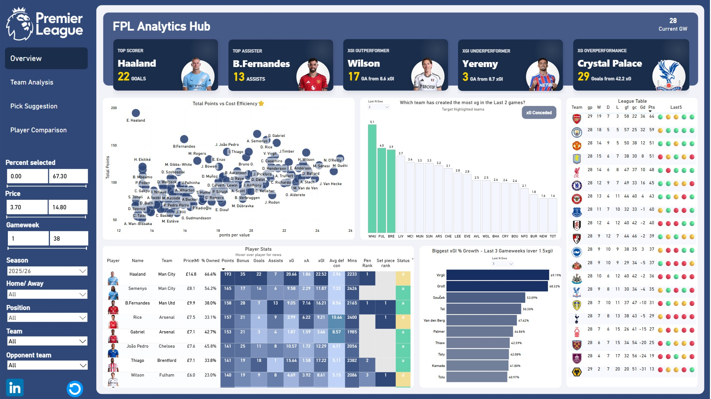

# FPL Analytics Hub 2.0

A rebuilt Fantasy Premier League analytics dashboard, motivated by maintainability issues in the original version and the positive reception it received after sharing on Reddit. The volume of requests for the `.pbix` file made me realise the importance of clean organisation, proper documentation, and a pipeline others could actually follow.

## Live Dashboard

[View the live dashboard on Power BI](https://app.powerbi.com/view?r=eyJrIjoiY2I5MGI5ZTgtMjJjYS00NmMyLTk0NTQtMjY4ZjhhMDQyYTkxIiwidCI6ImQxMjA2OTQzLWJmY2MtNGM3NC04MmQ0LTA1ZTYzYTQzMzViZiJ9)
---

## Dashboard

### Overview

### Team Analysis

### Pick Suggestion

### Player Comparison

---

## New Features

### Availability Tooltip (Overview)

Pulling all data directly from the API allowed for greater customisation. The availability tooltip displays live player status and injury news inline, without needing a separate table.

### Team Chance Creation & Concession Tables (Overview)

Two new tables allow users to spot teams that are conceding or creating a high volume of chances over a time frame they choose. This gives users more confidence when identifying which teams to target for attacking or defensive returns.

### xG/xA per 90 Parameter Slicer (Player Comparison)

A dynamic slicer filters the xG and xA per 90 scatter chart by the percentage of available minutes each player has played. For example in GW10 there are 900 available minutes — setting the slicer to 50% shows only players who have played at least 450 minutes. Without this, the chart either surfaces outliers from players with very few minutes or requires hardcoding a minimum threshold that excludes players unfairly.

### Player Comparison Tooltip Overhaul

The HTML tooltip UI in the player comparison page has been fully redesigned for clarity and visual consistency with the rest of the dashboard.

---

## What Changed and Why

The original dashboard was built as a learning project. Early mistakes and bad habits accumulated over time, making the model increasingly difficult to maintain and scale. Two specific problems drove the rebuild.

### 1. Messy Power Query

The original dashboard handled a lot of transformation and loading within Power Query. Steps were inconsistently named, logic was hard to trace, and debugging required navigating a long chain of tightly coupled steps. This caused long refresh times and occasional freezing despite the model not being particularly large. Much of this stemmed from the absence of global keys for players and teams across seasons.

### 2. Player and Team IDs Breaking Between Seasons

FPL rebuilds its internal player IDs every season. My workaround was a series of complex joins that technically worked but were hard to follow and contributed to the performance issues mentioned above.

---

## Architectural Changes

### Python Data Pipeline

All data is now sourced directly from the FPL API in Python. Intensive calculations for player recommendations have also been moved to Python, improving loading times by over 80%.

### Folder-Based Incremental Loading

Each gameweek is saved as its own CSV file (`gw1.csv`, `gw2.csv` etc.) in a dedicated folder. Power BI reads the whole folder and appends automatically.

Previously I merged each new gameweek into a single master file in Python before Power BI read it. This caused occasional issues where running the merge script twice resulted in duplicated data that had to be manually unpicked. The new approach also allows mid-gameweek updates — running the script simply overwrites the current gameweek file rather than appending to a master.

### Cross-Season Player Identity

The rebuild uses the `code` field from the FPL `bootstrap-static` endpoint, which maps to the Opta player ID and remains stable across seasons. This replaces the fragile internal `id` field as the global player key, making cross-season joins straightforward and reliable.

---

## Data Model

| Table | Type | Key | Relates To | Source |
|---|---|---|---|---|
| FactTable | Fact | player_code + gameweek | Players / Teams / Opponent / Date / Season | Python (CSV folder) |
| Players | Dimension | player_code (Opta ID) | FactTable / Position | Python (CSV) |
| Teams | Dimension | team_code | FactTable / Fixtures | Power Query (API) |
| Opponent Teams | Dimension | opponent_id | FactTable / Fixtures | Duplicate of Teams |
| Position | Dimension | position_id | Players | DAX Table |
| Date | Dimension | Date | FactTable / Fixtures | DAX Table |
| Season | Dimension | season_id | FactTable | Power Query |
| Fixtures | Fact | team_code | Teams / Opponent (slicer only) | Power Query (API) |
| FPL Fantasy Data | Reference | gameweek_id | Standalone | Power Query (API) |
| FPL Player Scores | Reference | player_code | Standalone | Python (CSV) |

> Fixtures is unpivoted to one row per team, enabling the team slicer to filter correctly regardless of whether the selected team is home or away.

---

## Tech Stack

| Tool | Role |
|---|---|
| Python (requests, pandas) | API extraction, data shaping, CSV output |
| Power Query (M Code) | File ingestion, light transformation, reference table API calls |
| DAX | Measures, KPIs, dynamic filtering |
| Power BI Desktop | Data modelling and visualisation |
| FPL API | Primary data source |
